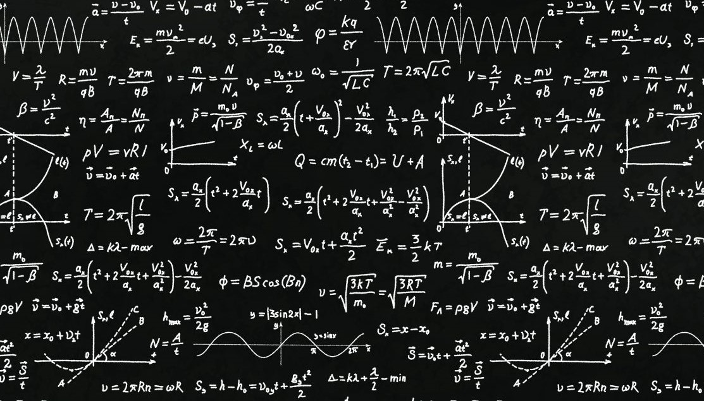

# DAPE1300-Discrete-Mathematics 🔢
### Course subjects

| Norwegian                         | English                               |
| --------------------------------- |---------------------------------------|
| Teoretisk informatikk             | Theoretical computer science          |
| Logikk og predikatlogikk          | Logic and predicate logic             |
| Mengdelære: Kvantitativ teori     | Quantitative theory                   |
| Generelle funksjoner              | General functions                     |
| Følger og rekker                  | Follows, relations, reaches           |
| Tallmatriser og logiske matriser  | Number matrices and logical matrices  |
| Algoritmer og algoritmeanalyse    | Algorithms and algorithm analysis     |
| Tallteori, heltallsregning        | Number theory, integer arithmetic     |
| Tallsystemer, kongruensregning    | Number systems, congruence calculus   |
| Bevis og induksjon                | Proof and induction                   |
| Oppregning og utvalg              | Enumeration and selection             |
| Binomial koeffisient              | Binomial coefficient                  |
| Kombinatorikk og permutasjoner    | Combinatorics and permutations        |
| Differensiallikninger             | Differential equations                |
| Relasjoner, ordninger             | Relationships, arrangements           |
| Grafteori og trær                 | Graph theory and trees                |

---
Discrete Math by Kimberly Brehm: [Video Lectures](https://www.youtube.com/watch?v=A3Ffwsnad0k&list=PL_i8siNd6UcYh4oqn2KHh8hzzCPrTjM11&index=1)

---

_img courtasy: johns hopkins university_

---
