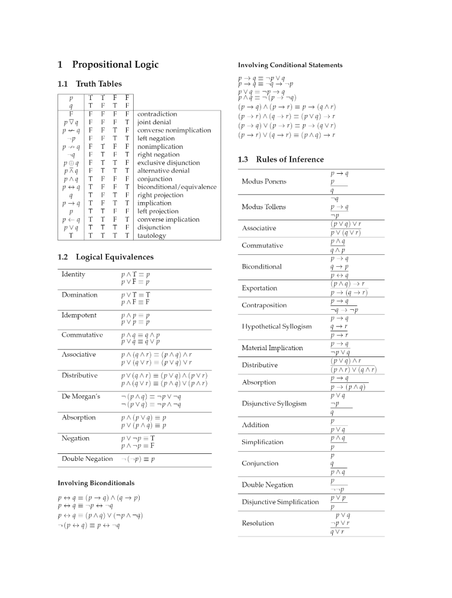

# DAPE1300-Discrete-Mathematics
### FAGETS EMNER:

* Teoretisk informatikk
* Logikk og predikatlogikk
* Mengdelære: Kvantitativ teori
* Generelle funksjoner
* Følger og rekker
* Tallmatriser og logiske matriser
* Algoritmer og algoritmeanalyse
* Tallteori, heltallsregning
* Tallsystemer, kongruensregning
* Bevis og induksjon
* Oppregning og utvalg
* Binomial koeffisient
* Kombinatorikk og permutasjoner
* Differensiallikninger
* Relasjoner, ordninger
* Grafteori og trær

English:
* Theoretical computer science
* Logic and predicate logic
* Quantitative theory
* General functions
* Follows and reaches
* Number matrices and logical matrices
* Algorithms and algorithm analysis
* Number theory, integer arithmetic
* Number systems, congruence calculus
* Proof and induction
* Enumeration and selection
* Binomial coefficient
* Combinatorics and permutations
* Differential equations
* Relationships, arrangements
* Graph theory and trees

---

Discrete Math by Kimberly Brehm: [Video Lectures](https://www.youtube.com/watch?v=A3Ffwsnad0k&list=PL_i8siNd6UcYh4oqn2KHh8hzzCPrTjM11&index=1)

---

